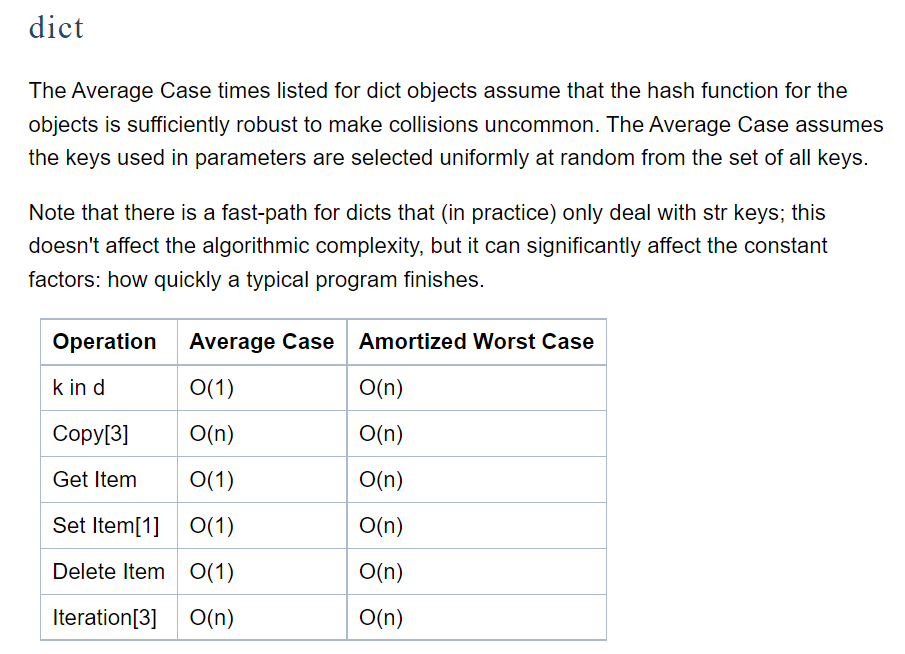
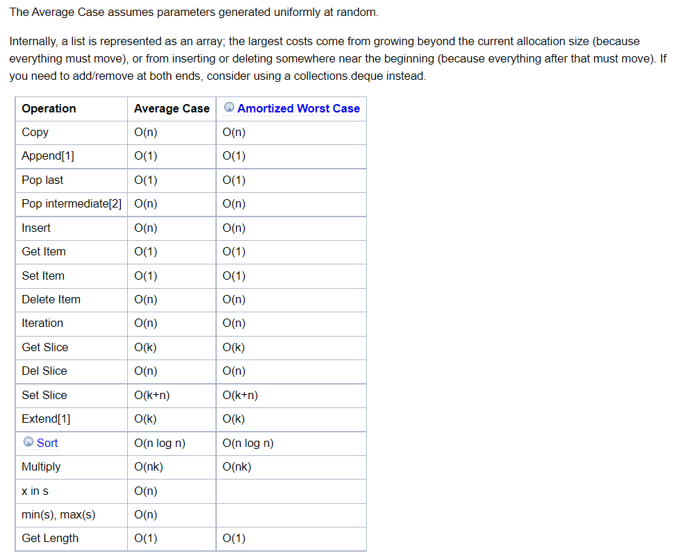
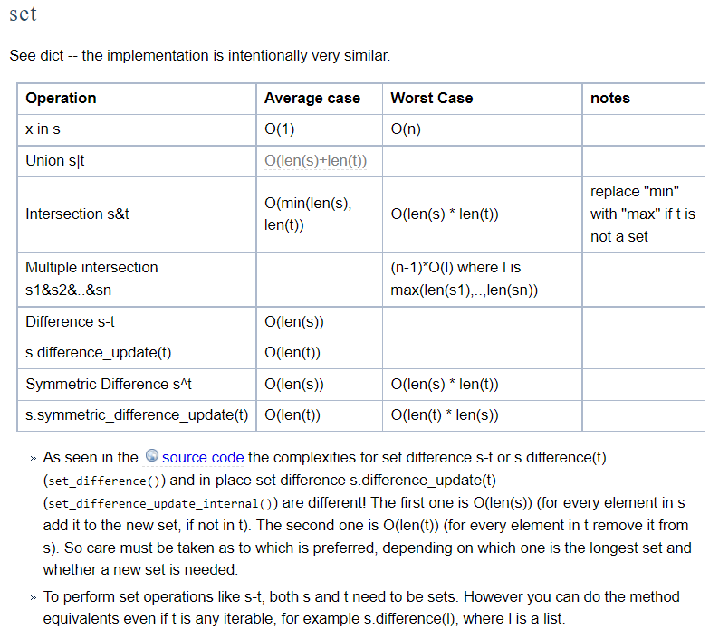
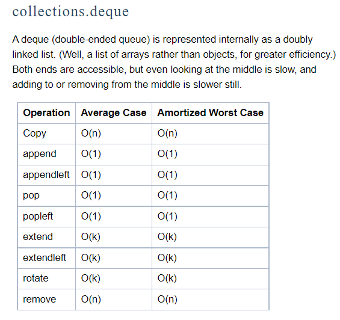
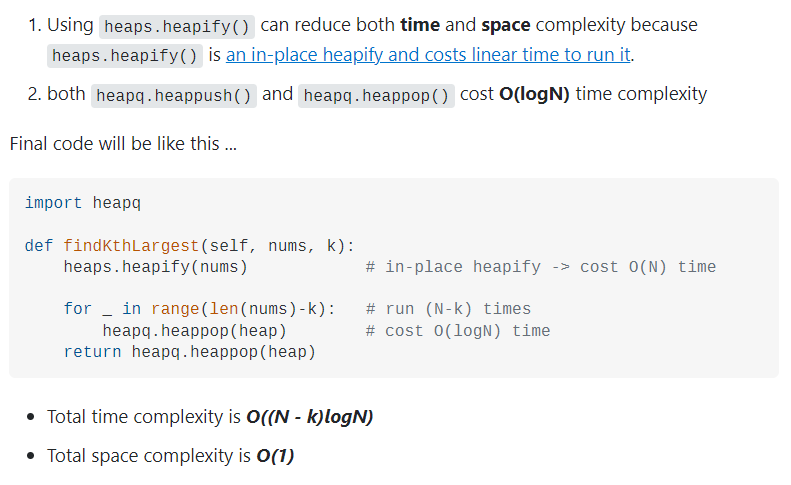

## Table of Contents
- [Built-in Types](#built-in-types)
  - [Boolean Types](#boolean-types)
  - [Numeric Types](#numeric-types)
  - [Sequence Types](#sequence-types)
    - [Mutable Sequences](#mutable-sequences)
    - [Immutable Sequences](#immutable-sequences)
  - [Set Types](#set-types)
  - [Mapping Types](#mapping-types)
- [Dictionaries](#dictionaries)
  - [Iteration](#dictionary-iteration)
  - [Sorting](#dictionary-sorting)
- [Lists](#lists)
  - [List or String slicing in Python](#list-or-string-slicing-in-python)
  - [Comprehensions](#list-comprehensions)
  - [Initialization](#list-initialization)
  - [Reversal](#list-reversal)
  - [Sorting](#list-sorting)
- [Tuples](#tuples) 
- [Strings](#strings)
  - [From List](#from-list)
  - [Python String Constants](#string-constants)
  - [`isalnum()`](#isalnum)
  - [`split()`](#split)
  - [`strip()`](#strip)
  - [`str()` vs `repr()`](#str-vs-repr)
- [Sets](#sets)
- [Deque](#deque)
- [Heapq](#heapq)
- [Counter](#counter)
- [Built-in or Library functions](#built-in-or-library-functions)
  - [Functions to iterate over list / other iterable (tuple, dictionaries)](#functions-to-iterate-over-list--other-iterable-tuple-dictionaries)
  - [Getting ASCII value of a character](#getting-ascii-value-of-a-character)
- [Iterators](#iterators)
  - [Iterator vs Iterable](#iterator-vs-iterable)
  - [How for loop actually works](#how-for-loop-actually-works)
  - [Creating an Iterator](#creating-an-iterator)
- [Functional Iteration](#functional-iteration)
  - [`map()`](#map)
  - [`filter()`](#filter)
  - [`reduce()`](#reduce)
- [Decorators](#decorators)
  - [`@classmethod`](#classmethod)
  - [`@staticmethod`](#staticmethod)
  - [`@property`](#property)
- [Generators](#generators)
  - [Using `yield`](#using-yield)
  - [Generator Expressions](#generator-expressions)
- [Other Useful Built-in Functions](#other-useful-built-in-functions)
  - [`abs()`](#abs)
  - [`any()`](#any)
  - [`all()`](#all)
  - [`chr()`](#chr)
  - [`enumerate()`](#enumerate)
  - [`input()`](#input)
  - [`isinstance()`](#isinstance)
  - [`len()`](#len)
  - [`max()`](#max)
  - [`min()`](#min)
  - [`ord()`](#ord)
  - [`pow()`](#pow)
  - [`type()`](#type) 
- [Common Gotchas](#common-gotchas)
  - [Nested List Initialization](#nested-list-initialization)
  - [Mutable Default Arguments](#mutable-default-arguments)
- [Clean Code Tips](#clean-code-tips)
  - [Doc Strings](#doc-strings)
  - [Asserts](#asserts)
  - [Other Tips](#other-tips)
- [Miscellaneous](#miscellaneous)
  - [How to take multiple line input in python?](#how-to-take-multiple-line-input-in-python)
  - [Important Python Math Functions](#important-python-math-functions)
    - [`math.log()`](#mathlog)
    - [`math.ceil()`](#mathceil)
    - [Other Math Functions](#other-math-functions)
  - [Custom Comparators](#custom-comparators)
- [Others](#others)
- [Resources](#resources)

<sup><sub>[▲ TOP](#table-of-contents)</sub></sup>
## Built-in Types
In this section I have included information on the more basic built-in types. For information on more specialized built-in types, check out the [Python documentation](https://docs.python.org/3/library/stdtypes.html)

### Boolean Types
```python3
class 'bool'
```

By default, an object is considered `True` unless its class defines either a `__bool__()` method that returns `False` or a `__len__()` method that returns zero. Here are most of the built-in objects considered `False`:
- constants defined to be false: `None` and `False`
- zero of any numeric type: `0`, `0.0`, `0j`, `Decimal(0)`, `Fraction(0, 1)`
- empty sequences and collections: `''`, `()`, `[]`, `{}`, `set()`, `range(0)`

### Numeric Types
```python3
class 'int'
class 'float'
class 'complex'
```

Integers have unlimited precision. Floating point numbers are usually implemented using `double` in C, and are therefore system-dependent. Complex numbers have a real and imaginary part, which can be accessed using `z.real` and `z.imag`, respectively. Complex numbers must include `j` appended to a numeric literal (`0j` is acceptable for when you want a `complex` value with no imaginary part).

The standard libarary includes additional numeric types, [Fraction](https://docs.python.org/3/library/fractions.html#module-fractions)s which hold rationals, and [Decimal](https://docs.python.org/3/library/decimal.html#module-decimal)s which hold floating-point numbers with user-definable precision.

### Sequence Types
Immutable sequences have support for the `hash()` built-in, while mutable sequences do not. This means that immutable sequences can be used as `dict` keys or stored in `set` and `frozenset` instances, while mutable sequences cannot.

#### Mutable Sequences
```python3
class 'list'
class 'bytearray
```

`bytearray` objects are a mutable counterpart to `bytes` objects.

#### Immutable Sequences
```python3
class 'tuple'
class 'range'
class 'str'
class 'bytes'
```

`bytes` objects are sequences of single bytes. The syntax for `bytes` literals is largely the same as that for string literals, except that a `b` prefix is added:  
- Single quotes: `b'still allows embedded "double" quotes'`
- Double quotes: `b"still allows embedded 'single' quotes"`
- Triple quotes: `b'''3 single quotes'''`, `b"""3 double quotes"""`

Only ASCII chars are permitted in `bytes` literals.  
`bytes` objects actually behave like immutable sequences of integers, with each value restricted to `0 <= x < 256`.

`bytes` objects can be created in several ways:
- A zero-filled bytes object of a specific length: `bytes(10)`
- From an iterable of integers: `bytes(range(20))`
- Copying existing binary data via the buffer protocol: `bytes(obj)`

### Set Types
```python3
class 'set'
class 'frozenset'
```

`set` is mutable, while `frozenset` is immutable.  
Note that since `frozenset` is immutable, it must be entirely populated at the moment of construction. It cannot use the literal curly brace syntax that ordinary `set` uses, as that syntax is reserved for `set`.

Instead, use `frozenset([iterable])`.

### Mapping Types
```python3
class 'dict'
```

See the [Dictionaries](#dictionaries) section for more info.

<sup><sub>[▲ TOP](#table-of-contents)</sub></sup>
## Dictionaries

> Dictionaries are used to store data values in key:value pairs. *Info about **collections.Counter()** available below.*
> 

```python
dict = {'a':1,'b':2,'c':3}

dict.keys() # returns list of keys of dictionary
dict.values() # returns list of values of dictionary
dict.get('a') # returns value for any corresponding key
dict.items() # returns [('a',1),('b',2),('c',3)]
dict.copy() # returns copy of the dictionary
# NOTE : items() Returns view object that will be updated with any future
# changes to dict
dict.pop(KEY) # pops key-value pair with that key
dict.popitem() # removes most recent pair added
dict.setDefault(KEY,DEFAULT_VALUE)
# returns value of key, if key exists, else default value returned
# If the key exist, this parameter(DEFAULT_VALUE) has no effect.
# If the key does not exist, DEFAULT_VALUE becomes the key's value. 2nd
# argument's default is None.
dict.update({KEY:VALUE})
# inserts pair in dictionary if not present, if present, corresponding value is
# overriden (not key)
# defaultdict ensures that if any element is accessed that is not present in
# the dictionary
# it will be created and error will not be thrown (which happens in normal dictionary)
# Also, the new element created will be of argument type, for example in the below line
# an element of type 'list' will be made for a Key that does not exist
myDictionary = defaultdict(list) 
```

##### Time Complexities

  

### Dictionary Iteration
Get w/ default value if key not in dict:
```python
my_dict[k] = my_dict.get(k, 0) + 1; # get retrieves value for k, or 0 if k not in dict
```

Iterating a dict iterates only the keys:
```python
for k in my_dict:  # k will be each key, not each key-value pair
    ...
```

Testing membership: `if k in dict: ...`

To get actual key-value pairs at the same time:
```python
for k,v in my_dict.items():
    ...
```
applies to comprehensions as well: `new_d = {k: v+1 for k,v in d.items()}`

### Dictionary Sorting
It is not possible to sort a dictionary, only to get a representation of a dictionary that is sorted. Dictionaries are inherently orderless, but other types, such as lists and tuples, are not. So you need an ordered data type to represent sorted values, which will be a list—probably a list of tuples.  
- `sorted(d.items())`
  - sorted list of key-value pairs by key
  - by value: `sorted(d.items(), key=lambda x: x[1]`
- `sorted(d)`
  - sorted list of keys only
  - sorted list of keys by value: `sorted(d, key=lambda x: d[x])`

<sup><sub>[▲ TOP](#table-of-contents)</sub></sup>
## Lists
> Lists are used to store multiple items in a single variable
> 

```python
nums = [1,2,3]

nums.index(1) # returns index
nums.append(1) # appends 1
nums.insert(0,10) # inserts 10 at 0th index
nums.remove(3) # removes all instances of 3
nums.copy(1) # returns copy of the list
nums.count(1) # returns no.of times '1' is present in the list
nums.extend(someOtherList) # ...
nums.pop() # pops last element [which element to pop can also be given as optional argument]
nums.reverse() # reverses original list (nums in this case)
nums.sort() # sorts list [does NOT return sorted list]
#Python's default sort uses Tim Sort, which is a combination of both merge sort and insertion sort.
```

##### Time Complexities

  

### List or String slicing in Python

- Resource
    
    [Understanding slice notation](https://stackoverflow.com/questions/509211/understanding-slice-notation)
    

```python
It's pretty simple really:

a[start:stop]  # items start through stop-1
a[start:]      # items start through the rest of the array
a[:stop]       # items from the beginning through stop-1
a[:]           # a copy of the whole array
There is also the step value, which can be used with any of the above:

a[start:stop:step] # start through not past stop, by step
The key point to remember is that the :stop value represents the first value
that is not in the selected slice. So, the difference between stop and start is
the number of elements selected (if step is 1, the default).

The other feature is that start or stop may be a negative number, which means
it counts from the end of the array instead of the beginning. So:

a[-1]    # last item in the array
a[-2:]   # last two items in the array
a[:-2]   # everything except the last two items
Similarly, step may be a negative number:

a[::-1]    # all items in the array, reversed
a[1::-1]   # the first two items, reversed
a[:-3:-1]  # the last two items, reversed
a[-3::-1]  # everything except the last two items, reversed
Python is kind to the programmer if there are fewer items than you ask for. For
example, if you ask for a[:-2] and a only contains one element, you get an
empty list instead of an error. Sometimes you would prefer the error, so you
have to be aware that this may happen.

Relation to slice() object
The slicing operator [] is actually being used in the above code with a slice()
object using the : notation (which is only valid within []), i.e.:

a[start:stop:step]
is equivalent to:

a[slice(start, stop, step)]
Slice objects also behave slightly differently depending on the number of
arguments, similarly to range(), i.e. both slice(stop) and slice(start, stop[,
step]) are supported. To skip specifying a given argument, one might use None,
so that e.g. a[start:] is equivalent to a[slice(start, None)] or a[::-1] is
equivalent to a[slice(None, None, -1)].

While the :-based notation is very helpful for simple slicing, the explicit use
of slice() objects simplifies the programmatic generation of slicing.
```

### List Comprehensions
General Syntax:
```python
[<expression> for item in list if conditional]
```
is equivalent to:
```python
for item in list:
    if conditional:
        <expression>
```

Note how the order of the `for` and `if` statements remains the same.
For example, 
```python
for row in grid:
    for x in row:
        <expression>
```
is the same as
```python
[<expression> for row in grid for x in row]
```

### List Initialization
Can use comprehensions:
```python
my_list = [i for i in range(10)] # [0, 1, 2, 3, 4, 5, 6, 7, 8, 9]
```
2-D list (list of lists):
```python
my_list = [[] for i in range(3)] # [[], [], []]
```
This is useful for a "visited" grid of some kind (common in Dynamic Programming problems):
```python
visited = [[0 for i in range(len(grid[0]))] for j in range(len(grid))]
```
*BE CAREFUL* when initializing a matrix.
Do this:
```python
my_list = [[None] * n for i in range(n)]
```
**NOT** this:
```python
my_list = [[None] * n] * n
```
The latter method makes copies of the **reference** to the original list, thus any modification to one row will change the other rows in the same way. The first method does not do this.

A list can be created from a string using `list(my_str)`
We can apply a filter as well:
```python
my_list = list(c for c in my_str if c not in ('a', 'c', 'e'))
```

### List Reversal
 - `my_list[::-1]`
   - returns copy of list in reverse
 - `reversed(my_list)`
   - returns an iterator on the list in reverse
   - can turn into a list via `list(reversed(my_list))`
 - `my_list.reverse()`
   - actually modifies the list
 
### List Sorting
 - `sorted(my_list)`
   - returns copy of sorted list
 - `my_list.sort()`
   - actually modifies the list
   
 By default, these methods will sort the list in ascending order.
 For descending order, we can supply the arg `reverse=True` to either of the aforementioned methods.
 
 We can also override the key for sorting by supplying the `key` arg.
 For example, if we have a list of tuples and we want to use the second item as the key:
 ```python
 list1 = [(1, 2), (3, 3), (4, 1)] 
 list1.sort(key=lambda x: x[1]) # list1 is now [(4, 1), (1, 2), (3, 3)]
 ```
 Additionally, if we want to sort in descending order:
 ```python
 list1.sort(key=lambda x: x[1], reverse=True) # list1 is now [(3, 3), (1, 2), (4, 1)]
 ```
 
 When using `sorted()` it works the same, except we supply the list as the first arg:
 ```python
 list2 = sorted(list1, key=lambda x: x[1], reverse=True)
 ```

<sup><sub>[▲ TOP](#table-of-contents)</sub></sup>

## Tuples

> A [tuple](https://www.scaler.com/topics/python/tuples-in-python/) is a collection which is ordered, unchangeable and can contain duplicate values
> 

> Time complexities are similar to list
>
    

```python
tuple = (1,2,3,1)

tuple.count(1) # returns occurence of an item
tuple.index(1) # returns index of 1 in array
```
<sup><sub>[▲ TOP](#table-of-contents)</sub></sup>

## Strings

[Python String isnumeric()](https://www.programiz.com/python-programming/methods/string/isnumeric)

```python
# ** split Function **
# The split() method breaks up a string at the specified separator and returns
# a list of strings.
text = 'Python is a fun programming language'

# split the text from space
print(text.split(' '))
# Output: ['Python', 'is', 'a', 'fun', 'programming', 'language']

# convert string to list
s="abcd"
s=list(s)
print(s)
# Output: ['a', 'b', 'c', 'd']

# ** count Function **
# The count() method returns the number of occurrences of a substring in the given string.
# Example
message = 'python is popular programming language'
# number of occurrence of 'p'
print('Number of occurrence of p:', message.count('p')) # Output: Number of occurrence of p: 4

# The isnumeric() method returns True if all characters in a string are numeric characters. If not, it returns False.
s = '1242323'
print(s.isnumeric()) #Output: True

# The find() method returns the index of first occurrence of the substring (if found). If not found, it returns -1.
# check the index of 'fun'
print(message.find('fun')) # Output: 12

# The isalnum() method returns True if all characters in the string are alphanumeric (either alphabets or numbers). If not, it returns False.

name = "M3onica Gell22er "
print(name.isalnum()) # Output : False

# The isalpha() method returns True if all characters in the string are alphabets. If not, it returns False
name = "Monica"
print(name.isalpha()) #output true

# other important functions
string.strip([chars]) #The strip() method returns a copy of the string by removing both the leading and the trailing characters (based on the string argument passed).
string.upper() # The upper() method converts all lowercase characters in a string into uppercase characters and returns it.
string.lower() # The lower() method converts all uppercase characters in a string into lowercase characters and returns it.
string.islower() # The islower() method returns True if all cased characters in the string are lowercase and there is at least one cased character, False otherwise.
string.isdigit() 
string.isupper() # The isupper() method returns True if all cased characters in the string are uppercase and there is at least one cased character, False otherwise.
```

### From List
```python
my_list = ['te', 's', 't', '1', '2', '3', '_']
s = ''.join(my_list) # "test123_"
s2 = ''.join(c for c in my_list if c.isalnum()) # "test123"
```

### String Constants
Python has a lot of useful string constants. A few of them are shown below.
For a complete list, see the [documentation](https://docs.python.org/3.7/library/string.html)
 - `string.ascii_letters`
 - `string.digits`
 - `string.whitespace`
 
 e.g. `if d in string.digits: ...`
 
### `str()` vs `repr()`
See [this GeeksForGeeks article](https://www.geeksforgeeks.org/str-vs-repr-in-python/) for more info.

<sup><sub>[▲ TOP](#table-of-contents)</sub></sup>

## Sets

> A set is a collection which is unordered, immutable, unindexed, No Duplicates.
>  

```python
set = {1,2,3}

set.add(item)
set.remove(item)
set.discard(item) | set.remove(item)
# removes item | remove will throw error if item is not there, discard will not
set.pop() # removes random item (since unordered)

set.isdisjoint(anotherSet) # returns true if no common elements
set.issubset(anotherSet) # returns true if all elements from anotherSet is present in original set
set.issuperset(anotherSet) # returns true if all elements from original set is present in anotherSet

set.difference(anotherSet) # returns set containing items ONLY in first set
set.difference_update(anotherSet) # removes common elements from first set [no new set is created or returned]
set.intersection(anotherSet) # returns new set with common elements
set.intersection_update(anotherSet) # modifies first set keeping only common elements
set.symmetric_difference(anotherSet) # returns set containing all non-common elements of both sets
set.symmetric_difference_update(anotherSet) # same as symmetric_difference but changes are made on original set

set.union(anotherSet) # ...
set.update(anotherSet) # adds anotherSet without duplicate

```

##### Time Complexities

  

<sup><sub>[▲ TOP](#table-of-contents)</sub></sup>

## Deque

> A double-ended queue, or deque, has the feature of adding and removing elements from either end.
> 

```python

#in BFS(Breadth-first search) or other algorithms where we have to pop or add elements to the begining , deque is the best option 
#we can also use list, but list.pop(0) is O(n) operation where as dequeu.popleft() is O(1)

from collections import deque

queue = deque(['name','age','DOB'])

queue.append("append_from_right") # Append from right
queue.pop() # Pop from right

queue.appendleft("fromLeft") # Append from left
queue.popleft() # Pop from left

queue.index(element,begin_index,end_index) # Returns first index of element b/w the 2 indices.
queue.insert(index,element)
queue.remove() # removes first occurrance
queue.count() # obvious

queue.reverse() # reverses order of queue elements
```

##### Time Complexities
    
  

<sup><sub>[▲ TOP](#table-of-contents)</sub></sup>

## Heapq

> As we know the Heap Data Structure is used to implement the Priority Queue ADT. In python we can directly access a Priority Queue implemented using a Heap by using the **Heapq** library/module.
>  

```python
import heapq # (minHeap by Default)

nums = [5, 7, 9, 1, 3]

heapq.heapify(nums) # converts list into heap. Can be converted back to list by list(nums).
heapq.heappush(nums,element) # Push an element into the heap
heapq.heappop(nums) # Pop an element from the heap
# heappush(heap, ele) :- This function is used to insert the element mentioned
# in its arguments into heap. The order is adjusted, so as heap structure is
# maintained.
# heappop(heap) :- This function is used to remove and return the smallest
# element from heap. The order is adjusted, so as heap structure is maintained.

# Other Methods Available in the Library
# Used to return the k largest elements from the iterable specified 
# The key is a function with that accepts single element from iterable,
# and the returned value from that function is then used to rank that element in the heap
heapq.nlargest(k, iterable, key = fun)
heapq.nsmallest(k, iterable, key = fun)


#Max heap in python 

#By default heapq in python is min heap, 
#if we want to use max heap we can simply invert the value of the keys and use heapq. 
#For example, turn 1000.0 into -1000.0 and 5.0 into -5.0.

#The easiest and ideal solution
#Multiply the values by -1

#All the highest numbers are now the lowest and vice versa.

#Just remember that when you pop an element to multiply it with -1 in order to get the original value again.

#Example: 

import heapq
heap = []
heapq.heappush(heap, 1*(-1))
heapq.heappush(heap, 10*(-1))
heapq.heappush(heap, 20*(-1))
print(heap)

The output will look like:

[-20, -1, -10]

#when popping element multiply it with -1

max_element = -heapq.heappop(heap)
print(max_element)

Output will be:
20
```

##### Time Complexities
    
  

<sup><sub>[▲ TOP](#table-of-contents)</sub></sup>

## Counter

> Python Counter is a container that will hold the count of each of the elements present in the container. The counter is a sub-class available inside the dictionary class. Specifically used for element frequencies
> 

*Pretty similar to dictionary, in fact I use* **defaultdict(int)** *most of the time* 

```python
from collections import Counter #(capital 'C')
# can also be used as 'collections.Counter()' in code

list1 = ['x','y','z','x','x','x','y', 'z']

# Initialization
Counter(list1) # => Counter({'x': 4, 'y': 2, 'z': 2})
Counter("Welcome to Guru99 Tutorials!") # => Counter({'o': 3, ' ': 3, 'u': 3, 'e': 2.....})

# Updating
counterObject = collections.Counter(list1)
counterObject.keys() = [ 'x' , 'y' , 'z' ]
most_common_element = counterObject.most_common(1) # [('x', 4)]
counterObject.update("some string") # => Counter({'o': 3, 'u': 3, 'e': 2, 's': 2})
counterObject['s'] += 1 # Increase/Decrease frequency

# Accessing
frequency_of_s = counterObject['s']

# Deleting
del couterObject['s']

```
<sup><sub>[▲ TOP](#table-of-contents)</sub></sup>

## Built-in or Library functions

### Functions to iterate over list / other iterable (tuple, dictionaries)
    
    ```python
    
    ** map(fun, iter) **
    # fun : It is a function to which map passes each element of given iterable.
    # iter : It is a iterable which is to be mapped.
    
    ** zip(list,list) **
    for elem1,elem2 in zip(firstList,secondList):
    	# will merge both lists and produce tuples with both elements
    	# Tuples will stop at shortest list (in case of both lists having different len)
    # Example
    '''
    a = ("John", "Charles", "Mike")
    b = ("Jenny", "Christy", "Monica")
    
    x = zip(a, b)
    
    # use the tuple() function to display a readable version of the result:
    
    print(tuple(x))
    o/p: (('John', 'Jenny'), ('Charles', 'Christy'), ('Mike', 'Monica'))
    '''
    
    ** any(list) ** [ OPPOSITE IS => ** all() ** ]
    any(someList) # returns true if ANY element in list is true [any string, all numbers except 0 also count as true]
    
    ** enumerate(list|tuple) ** 
    # [when you need to attach indexes to lists or tuples ]
    enumerate(anyList) # ['a','b','c'] => [(0, 'a'), (1, 'b'), (2, 'c')]
    
    ** filter(function|list) **
    filter(myFunction,list) # returns list with elements that returned true when passed in function
    
    ***************** import bisect ***********************
    
    ** bisect.bisect(list,number,begin,end) ** O(log(n))
    # [ returns the index where the element should be inserted 
    #		such that sorting order is maintained ]
    a = [1,2,4]
    bisect.bisect(a,3,0,4) # [1,2,4] => 3 coz '3' should be inserted in 3rd index to maintain sorting order
    
    # Other variants of this functions are => bisect.bisect_left() | bisect.bisect_right()
    # they have same arguments. Suppose the element we want to insert is already present
    # in the sorting list, the bisect_left() will return index left of the existing number
    # and the bisect_right() or bisect() will return index right to the existing number
    
    # ** bisect.insort(list,number,begin,end)       ** O(n) to insert
    # ** bisect.insort_right(list,number,begin,end) ** 
    # ** bisect.insort_left(list,number,begin,end)  ** 
    
    The above 3 functions are exact same of bisect.bisect(), the only difference
    is that they return the sorted list after inserting and not the index. The
    left() right() logic is also same as above.
    ```

### Getting ASCII value of a character
    
    ```python
      ** ord(str) **
      # returns ascii value of the character , Example ord("a") = 97
      ** chr(int) ** 
      # return character of given ascii value , Example chr(97) = "a"
    ```    
<sup><sub>[▲ TOP](#table-of-contents)</sub></sup>

## Iterators
In Python, an iterator is an object with a countable number of values that can be iterated upon.
An iterator is an object which implements the iterator protocol, consisting of `__iter__()` and `__next__()`.  
The `__iter__()` method returns an iterator on the object, and the `__next__()` method gets the next item using the iterator, or raises a `StopIteration` exception if the end of the iterable is reached.

### Iterator vs Iterable
Lists, tuples, dictionaries, and sets are all iterable objects. They are iterable *containers* which you can get an iterator from.
All these objects have a `__iter__()` method which is used to get an iterator:
```python3
mytuple = ("apple", "banana", "cherry")
myit = iter(mytuple)

print(next(myit)) # apple
print(next(myit)) # banana
print(next(myit)) # cherry
print(next(myit)) # raises StopIteration exception
```
Note -- `next(obj)` is the same as `obj.__next__()`.


### How for loop actually works
The `for` loop can iterate any iterable.  
The `for` loop in Python is actually implemented like so:
```python3
iter_obj = iter(iterable) # create iterator object from iterable

# infinite loop
while True:
    try:
        element = next(iter_obj) # get the next item
        # do something with element
    except StopIteration:
        break
```
So, internally, the `for` loop creates an iterator object by calling `iter()` on the iterable, and then repeatedly calling `next()` until a `StopIteration` exception is raised.

### Creating an Iterator
Here is an example of an iterator that will give us the next power of two in each iteration.
```python3
class PowTwo:
    """Class to implement an iterator of powers of two"""

    def __init__(self, max = 0):
        self.max = max

    def __iter__(self):
        self.n = 0
        return self

    def __next__(self):
        if self.n <= self.max:
            result = 2 ** self.n
            self.n += 1
            return result
        else:
            raise StopIteration
```

Now we can use it as follows:
```python3
>>> a = PowTwo(4)
>>> i = iter(a)
>>> next(i)
1
>>> next(i)
2
>>> next(i)
4
>>> next(i)
8
>>> next(i)
16
>>> next(i)
Traceback (most recent call last):
...
StopIteration
```
Or, alternatively, using a `for` loop:
```python3
>>> for i in PowTwo(5):
...     print(i)
...     
1
2
4
8
16
32
```
<sup><sub>[▲ TOP](#table-of-contents)</sub></sup>

## Functional Iteration
For some good explanations and examples for the following functions, see [here](http://book.pythontips.com/en/latest/map_filter.html).

Note that `map()` and `filter()` both return iterators, so if you want a list, you need to use `list()` on the output. However, this is typically better accomplished with list comprehensions or `for` loops for the sake of readability.
  
### `map()`
`map()` applies a function to all the items in a list.
```python
map(function_to_apply, list_of_inputs)
```
  
For example, the following code:
```python
items = [1, 2, 3, 4, 5]
squared = []
for i in items:
    squared.append(i**2)
```
can be accomplished more easily with `map()`:
```python3
items = [1, 2, 3, 4, 5]
squared = list(map(lambda x: x**2, items))
```

### `filter()`
`filter()` creates a list of elements for which a function returns `True`.
  
Here's an example:
```python3
number_list = range(-5, 5)
less_than_zero = list(filter(lambda x: x < 0, number_list))
print(less_than_zero) # [-5, -4, -3, -2, -1]
```

### `reduce()`
`reduce()` is used to perform a rolling computation on a list.

Here's an example:
```python3
from functools import reduce
number_list = [1, 2, 3, 4]
product = reduce((lambda x, y: x * y), number_list) # output: 24
```

Often times, an explicit `for` loop is more readable than using `reduce()`.
But if you're trying to flex in an interview, and the problem calls for it, it could be a nice way to subtly show your understanding of functional programming.

<sup><sub>[▲ TOP](#table-of-contents)</sub></sup>
## Decorators
A [decorator](https://www.scaler.com/topics/python/python-decorators/) is a function returning another function, usually applied as a function transformation using the `@wrapper` syntax. This syntax is merely syntactic sugar.

The following two function definitions are semantically equivalent:
```python3
def f(...):
    ...
f = staticmethod(f)

@staticmethod
def f(...):
    ...
```

### @classmethod
Transform a method into a class method. A class method receives the class as implicit first argument, just like how an instance method receives the instance. To declare a class method:
```python3
class C:
    @classmethod
    def f(cls, arg1, arg2, ...):
        ...
```

A class method can be called either on the class (like `C.f()`) or on an instance (like `C().f()`). The instance is ignored except for its class. If a class method is called for a derived class, the derived class object is passed as the implied first argument.

Note that class methods are not the same as C++ or Java static methods. If you want those, see [`@staticmethod`](#staticmethod).

### @staticmethod
Transform a method into a static method. A static method does not receive an implicit first argument. To declare a static method:
```python3
class C:
    @staticmethod
    def f(arg1, arg2, ...):
        ...
```

A static method can be called either on the class (like `C.f()`) or on an instance (like `C().f()`). Static methods in Python are similar to those found in Java or C++.

### @property
Return a property attribute.
Usage:
```python3
property(fget=None, fset=None, fdel=None, doc=None)
```
`fget` is a function for getting an attribute value. `fset` is a function for setting an attribute value. `fdel` is a function for deleting an attribute value. `doc` creates a docstring for the attribute.

The following is a typical use case for defining a managed attribute `x`:
```python3
class C:
    def __init__(self):
        self._x = None

    def getx(self):
        return self._x

    def setx(self, value):
        self._x = value

    def delx(self):
        del self._x

    x = property(getx, setx, delx, "I'm the 'x' property.")
```
Or, equivalently:
```python3
class C:
    def __init__(self):
        self._x = None

    @property
    def x(self):
        """I'm the 'x' property."""
        return self._x

    @x.setter
    def x(self, value):
        self._x = value

    @x.deleter
    def x(self):
        del self._x
```    

If `c` is an instance of `C`, then `c.x` will invoke the getter; `c.x = value` will invoke the setter; and `del c.x` the deleter.

If `doc` is not provided, the property will copy `fget`'s docstring, if it exists. Thus, it is straightforward to create read-only properties with the `@property` decorator:
```python3
class Parrot:
    def __init__(self):
        self._voltage = 100000

    @property
    def voltage(self):
        """Get the current voltage."""
        return self._voltage
```
The `@property` decorator turns the `voltage()` method into a “getter” for a read-only attribute with the same name, and it sets the docstring for `voltage` to “Get the current voltage.”

For more information, check out [the documentation](https://docs.python.org/3/library/functions.html#property) and [this Programiz article](https://www.programiz.com/python-programming/property).

<sup><sub>[▲ TOP](#table-of-contents)</sub></sup>
## Generators
Generators are simpler ways of creating [iterators](#iterators). The overhead of creating `__iter__()`, `__next__()`, raising `StopIteration`, and keeping track of state can all be handled internally by a generator.

A generator is a function that returns an object (iterator) which we can iterate over, one value at a time. 

### Using `yield`
To create a generator, simply define a function using a `yield` statement.

A function containing at least one `yield` statement (it may contain other `yield` and `return` statements) becomes a generator.

Both `yield` and `return` return some value from a function. The difference is that, while a `return` statement terminates a function entirely, `yield` pauses the function, saving its state and continuing from where it left off in successive calls.

Once a function yields, it is paused and control is transferred back to the caller. Local variables and their states are remembered between successive calls. When the function terminates, `StopIteration` is raised automatically on further calls.

Below is a simple generator example, for the sake of demonstrating how generators work.
```python3
def my_gen():
    n = 1
    print('This is printed first')
    yield n

    n += 1
    print('This is printed second')
    yield n
    
# Without for loop:
a = my_gen()
next(a) # 'This is printed first'
next(a) # 'This is printed second'
next(a) # Traceback ... StopIteration

# With for loop:
for item in my_gen():
    print(item)
````

Below is a more typical example. Generators often use loops with a suitable terminating condition.
```python3
def reverse(my_str):
    for i in range(len(my_str) - 1, -1, -1):
        yield my_str[i]
        
for char in reverse("hello"):
    print(char) # prints each char reverse on a new line
```
Note that the above example works not just with strings, but also other kinds of iterables.

### Generator Expressions
Generator expressions can be used to create an anonymous generator function. The syntax is similar to that of [list comprehensions](#list-comprehensions), but uses parentheses instead of square brackets. However, while a list comprehension produces the entire list, generator expressions produce one item at a time.

Generator expressions are kind of lazy, producing items only when asked for. For this reason, using a generator expression is much more memory efficient than an equivalent list comprehension.

```python3
items = [1, 3, 6]
item_squared = (item**2 for item in items)
print(next(item_squared)) # 1
print(next(item_squared)) # 9
print(next(item_squared)) # 36
next(item_squared) # StopIteration
```

Generator expressions can be used inside function calls. When used in such a way, the round parentheses can be dropped.
```python3
sum(x**2 for x in items) # 46
max(x**2 for x in items) # 36
```

<sup><sub>[▲ TOP](#table-of-contents)</sub></sup>
## Other Useful Built-in Functions
For a complete list of built-ins in Python 3, see [the documentation](https://docs.python.org/3/library/functions.html).
### `abs()`
Returns the absolute value of a number, either an integer or floating point number.
If the argument is a complex number, its magnitude is returned.

### `any()`
Usage:
```python
any(iterable)
```
`any()` takes any iterable as an argument and returns `True` if at least one element of the iterable is `True`.

```python
any([1, 3, 4, 0])   # True
any([0, False])     # False
any([0, False, 5])  # True
any([])             # False

any("This is good") # True
any("0")            # True
any("")             # False
```

See [here](https://www.programiz.com/python-programming/methods/built-in/any) for more info.

Check if any tuples contain a negative value:
```python
if any(x < 0 or y < 0 for (x, y) in list_ranges): ...
```

### `all()`
```python
all(iterable)
```
`all()` takes any iterable as an argument and returns `True` if all the elements of the iterable are `True`.

```python
all([1, 3, 4, 5])  # True
all([0, False])    # False
all([1, 3, 4, 0])  # False
all([0, False, 5]) # False
all([])            # True

all("This is good") # True
all("0")            # True
all("")             # True
```

See [here](https://www.programiz.com/python-programming/methods/built-in/all) for more info.

Check if all elements of a list are `x`: 
```python
if all(c == x for c in alst): ...
```

### `chr()`
Returns the string representing a character whose Unicode code point is the integer passed.

For example, `chr(97)` returns the string `a`, while `chr(8364)` returns the string `€`.

This is the inverse of [`ord()`](#ord).

### `enumerate()`
Usage:
```python3
enumerate(iterable, start=0)
```
Returns an enumerate object. `iterable` must be a sequence, iterator, or some object which suports iteration. The `__next__()` method of the iterator returned by `enumerate()` returns a tuple containing a count (from `start` which defaults to zero) and the values obtained from iterating over the iterable.  

Example:
```python3
seasons = ['Spring', 'Summer', 'Fall', 'Winter']
list(enumerate(seasons))              # [(0, 'Spring'), (1, 'Summer'), (2, 'Fall'), (3, 'Winter')]
list(enumerate(seasons, start=1))     # [(1, 'Spring'), (2, 'Summer'), (3, 'Fall'), (4, 'Winter')]
```
This is equivalent to:
```python3
def enumerate(sequence, start=0):
    n = start
    for elem in sequence:
        yield n, elem
        n += 1
```

### `input()`
Gets input from the user.
Usage:
```python3
input([prompt])
```

Example: 
```python3
>>> s = input('-> ')  
-> Monty Python's Flying Circus
>>> s  
"Monty Python's Flying Circus"
```
If the `prompt` arg is present, it is written to stdout without a trailing newline.

### `isinstance()`
Usage:
```python3
isinstance(object, classinfo)
```

Returns true if the `object` argument is an instance of the `classinfo` argument, or of a (direct, indirect, or virtual) subclass thereof. Returns false otherwise.

If `classinfo` is a tuple of type objects, return true if `object` is an instance of any of *any* of these types.

### `len()`
Return the length of an object. The argument may be a sequence (e.g. string, bytes, tuple, list, or range) or a collection (e.g. dictionary, set, frozen set).

### `max()`
Returns the max item in an iterable, or the max of multiple arguments passed.

### `min()`
Returns the min item in an iterable, or the min of multiple arguments passed.

### `ord()`
Given a string representing one Unicode character, return an integer representing the Unicode code point of that character.

For example, `ord('a')` returns the integer 97. `ord('€')` (Euro sign) return 8364. 

This is the inverse of [`chr()`](#chr).

### `pow()`
Usage:
```python3
pow(x, y[, z])
```
Return `x` to the power `y`; if `z` is present, return `x` to the power `y`, modulo `z` (computed more efficiently than `pow(x, y) % z`).  
`pow(x, y)` is equivalent to `x**y`.

### `type()`
Usage:
```python3
type(object)
type(name, bases, dict)
```

With one argument, return the type of `object`. The return value is a type object and generally the same object as returned by `object.__class__`.

E.g.
```python3
x = 5
type(x)  # class 'int'
```

The [`isinstance()`](#isinstance) function is recommended for testing the type of an object, since it accounts for subclasses.

<sup><sub>[▲ TOP](#table-of-contents)</sub></sup>
## Common Gotchas
### Nested List Initialization
When creating a list of lists, be sure to use the following structure:
```python
my_list = [[None] * n for i in range(n)]
```
Read the section on [list initialization](#list-initialization) to see why.

### Mutable Default Arguments
If we try to do something like `def f(x, arr=[])` this will most likely create undesirable behavior.
Default arguments are resolved *only once*, when the function is first defined. The same arg will be used in successive function calls. In the case of a mutable type like a list, this means that changes made to the list in one call will be carried over in successive calls.
Instead, consider doing:
```python
def f(x, arr=None):
    if not arr: arr = []
```

## Clean Code Tips

### Doc strings
  Documentation for your functions in the interview to look slick 😎
  
  A docstring is short for documentation string.
  
  Python docstrings (documentation strings) are the [string](https://www.programiz.com/python-programming/string) literals that appear right after the definition of a function, method, class, or module.
  
  Triple quotes are used while writing docstrings. For example:
  
  ```
  def double(num):
      """Function to double the value"""
      return 2*num
  ```
  
  Docstrings appear right after the definition of a function, class, or a module. This separates docstrings from multiline comments using triple quotes.
  
  The docstrings are associated with the object as their `__doc__` attribute.
  
  So, we can access the docstrings of the above function with the following lines of code:
  
  ```
  def double(num):
      """Function to double the value"""
      return 2*num
  print(double.__doc__)
  ```
  
  **Output**
  
  ```
  Function to double the value
  ```
    
### Asserts
  Use **Assert keyword** in python for testing edge cases. Looks more professional.
    
  ### Definition and Usage
  
  The `assert` keyword is used when debugging code.
  
  The `assert` keyword lets you test if a condition in your code returns True, if not, the program will raise an AssertionError.
  
  You can write a message to be written if the code returns False, check the example below.
  
  ```python
      x = "hello"
      
      #if condition returns False, AssertionError is raised:
      assert x == "goodbye", "x should be 'hello'"
  ```

### Other Tips    
**ALWAYS** be aware of any code snippet that is being **REPEATED** in your solution. **MODULARITY** #1 Priority. Refactoring is also an important part of  interview.
    - This is usually asked as a follow up after coding the solution. *Are there any changes you want to make to this solution?*

## Miscellaneous

### How to take multiple line input in python?
    
  [Taking multiple inputs from user in Python - GeeksforGeeks](https://www.geeksforgeeks.org/taking-multiple-inputs-from-user-in-python/)
  
  - Using split() method
  - Using List comprehension
  
  **Syntax :**
  
  ```
  input().split(separator, maxsplit)
  ```
  
  #### Example
  
  ```python
  # Python program showing how to
  # multiple input using split
   
  # taking two inputs at a time
  x, y = input("Enter a two value: ").split()
  print("Number of boys: ", x)
  print("Number of girls: ", y)
  print()
   
  # taking three inputs at a time
  x, y, z = input("Enter a three value: ").split()
  print("Total number of students: ", x)
  print("Number of boys is : ", y)
  print("Number of girls is : ", z)
  print()
   
  # taking two inputs at a time
  a, b = input("Enter a two value: ").split()
  print("First number is {} and second number is {}".format(a, b))
  print()
   
  # taking multiple inputs at a time
  # and type casting using list() function
  x = list(map(int, input("Enter a multiple value: ").split()))
  print("List of students: ", x)
  ```
  
  ```python
  # Python program showing
  # how to take multiple input
  # using List comprehension
   
  # taking two input at a time
  x, y = [int(x) for x in input("Enter two value: ").split()]
  print("First Number is: ", x)
  print("Second Number is: ", y)
  print()
   
  # taking three input at a time
  x, y, z = [int(x) for x in input("Enter three value: ").split()]
  print("First Number is: ", x)
  print("Second Number is: ", y)
  print("Third Number is: ", z)
  print()
   
  # taking two inputs at a time
  x, y = [int(x) for x in input("Enter two value: ").split()]
  print("First number is {} and second number is {}".format(x, y))
  print()
   
  # taking multiple inputs at a time
  x = [int(x) for x in input("Enter multiple value: ").split()]
  print("Number of list is: ", x)
  
  # taking multiple inputs at a time separated by comma
  x = [int(x) for x in input("Enter multiple value: ").split(",")]
  print("Number of list is: ", x)
  ```
  
### Important Python Math Functions
    
  [Python Math Module - GeeksforGeeks](https://www.geeksforgeeks.org/python-math-module/)
  
#### `math.log()`
  [Log functions in Python - GeeksforGeeks](https://www.geeksforgeeks.org/log-functions-python/)
    
  ```
  Syntax :
  math.log(a,Base)
  Parameters :a : The numeric value
  Base :  Base to which the logarithm has to be computed.
  Return Value :
  Returns natural log if 1 argument is passed and log with
  specified base if 2 arguments are passed.
  Exceptions :
  Raises ValueError is a negative no. is passed as argument.
  ```
  
  ```python
  import math
    
  # Printing the log base e of 14
  print ("Natural logarithm of 14 is : ", end="")
  print (math.log(14))
    
  # Printing the log base 5 of 14
  print ("Logarithm base 5 of 14 is : ", end="")
  print (math.log(14,5))
  ```
  
#### `math.ceil()`
  Finding the ceiling and the floor value.
  Ceil value means the smallest integral value greater than the number and the floor value means the greatest integral value smaller than the number. This can be easily calculated using the ceil() and floor() method respectively.
  
  ```python
  # Python code to demonstrate the working of
  # ceil() and floor()
   
  # importing "math" for mathematical operations
  import math
   
  a = 2.3
   
  # returning the ceil of 2.3 (i.e 3)
  print ("The ceil of 2.3 is : ", end="")
  print (math.ceil(a))
   
  # returning the floor of 2.3 (i.e 2)
  print ("The floor of 2.3 is : ", end="")
  print (math.floor(a))
  ```

#### Other Math Functions
  ```python
  # Constants
  # Print the value of Euler e (2.718281828459045)
  print (math.e)
  # Print the value of pi (3.141592653589793)
  print (math.pi)
  print (math.gcd(b, a))
  print (pow(3,4))
  # print the square root of 4
  print(math.sqrt(4))
  a = math.pi/6
  b = 30
   
  # returning the converted value from radians to degrees
  print ("The converted value from radians to degrees is : ", end="")
  print (math.degrees(a))
   
  # returning the converted value from degrees to radians
  print ("The converted value from degrees to radians is : ", end="")
  print (math.radians(b))
  ```
  
  ```python
  
  ** bin(int) **
  bin(anyNumber) # Returns binary version of number
  
  ** divmod(int,int) **
  divmod(dividend,divisor) # returns tuple like (quotient, remainder)
  
  ```

### Custom Comparators
  - Python cmp_to_key function to sort list with custom compare function
    
      [Sort a list of lists with a custom compare function](https://stackoverflow.com/questions/5213033/sort-a-list-of-lists-with-a-custom-compare-function)
    
      #### How the custom comparator works
    
      When providing a custom comparator, it should generally return an integer/float value that follows the following pattern (as with most other programming languages and frameworks):
    
      - return a negative value (`< 0`) when the left item should be sorted *before* the right item
      - return a positive value (`> 0`) when the left item should be sorted *after* the right item
      - return `0` when both the left and the right item have the same weight and should be ordered "equally" without precedence
    
      ```python
      from functools import cmp_to_key
      sorted(mylist, key=cmp_to_key(compare))
    
      # Example
      def compare(item1, item2):
          if fitness(item1) < fitness(item2):
              return -1
          elif fitness(item1) > fitness(item2):
              return 1
          else:
              return 0
      ```
    

> Python integer division acts a bit weird with -ve numbers ex: -3//2 will give -2 answer instead of -1 so always use int(-3/2) for integer division in problems
>

## Others
  ### ord()
  ```python
  ord('9') - ord('0') = 9
  ord('c') - ord('a') = 2
  ```

  ### chr()
  ```python
  chr(97) = a
  chr(ord('a') + 1) = b
  
  ## isdigit()
  ```python
  '2'.isdigit() == True
  'a'.isdigit() == False
  ```

  ### isalpha()
  ```python
  '2'.isalpha() == False
  'a'.isalpha() == True
  ```

  ### isspace()
  ```python
  ''.isspace() == False
  ' '.isspace() == True
  ```

  ### int()
  ```python
  int('234') = 234
  ```

  ### str()
  ```python
  str(234) = '234'
  ```

  ### heapq
  ```python
  import heapq

# Initialize Heap
minHeap = []
maxHeap = []
heapq.heapify(minHeap)
heapq.heapify(maxHeap)

# Push Elements 
heapq.heappush(minHeap, num) # (Defaults to minHeap)
heapq.heappush(maxHeap, -num) # (Workaround through negative sign for maxHeap)

# Peek
minHeap_smallest = minHeap[0]
maxHeap_largest = maxHeap[0]

# Create Max Heap of Strings
class MyString:
    def __init__(self, word):
        self.word = word

    def __lt__(self, other):
        return self.word > other.word

    def __eq__(self, other):
        return self.word == other.word
        
    def __str__(self):
        return self.word        

heapq.heappush(heap, MyString(word))  

#### Set attr for given class for heap sort ####
import heapq

class Node(object):
    def __init__(self, val: int):
        self.val = val

setattr(Node, "__lt__", lambda self, other: self.val <= other.val)
heap = [Node(2), Node(0), Node(1), Node(4), Node(2)]
heapq.heapify(heap)

while heap:
    node = heapq.heappop(heap)
    print(node.val)

```

  ### Array
  ```python
  arr = [ele1, ele2, ele3]
  filtered = filter(lambda x : x >=0, arr)
  min_positive = min(filtered)
  
  # Remove an element
  arr.remove(ele1)
  
  # Remove element based on index
  arr.pop(index) # Returns the value of the element at that index
  del arr[index]
  
  # Sort the meetings in increasing order of their start time.
  intervals.sort(key= lambda x: x[0]) # Assuming intervals = [[start_time, end_time], ...]
  ```

  ### String
  ```python
  S = 'aab'
  S.count('a') = 2
  set(S) = set(['a', 'b'])
  ```

  ### Set
  ```python
  S = set() # or S = {'a', 'e', 'i', 'u'}
  S.add(elem)
  S.remove(elem)
  ```

  ### defaultdict
  ```python
  from collections import defaultdict
  
  d = defaultdict(lambda : [])
  d[key].append(value) 
  
  # Iterate over keys:
  for k in d:
    print(k)
  
  # Iterate over keys and values:
  for k,v in d.items():
    print(k,v)
    
  # Delete an item from dictionary:
  del d[key]  
  
  # Custom Default Val
  class Node:
      def __init__(self, val=-1):
          self.val = val
          self.next = None
          self.prev = None
          
  node_dict = defaultdict(Node)
  check = node_dict[0]
  print(check.val)
  ```

  ### Counter
  ```python
  words = ["i", "love", "leetcode", "i", "love", "coding"]
  count = collections.Counter(words) # Counter({u'i': 2, u'love': 2, u'coding': 1, u'leetcode': 1}) --> Not necessarily in same order
  heap = [(-freq, word) for word,freq in count.items()]
  heapq.heapify(heap) # First orders with freq, if freq is same then it orders alphabetically i.e. a first, z last
  ```
  
  ### Bisect
  This module provides support for maintaining a list in sorted order without having to sort the list after each insertion. For long lists of items with expensive comparison operations, this can be an improvement over the more common approach. The module is called bisect because it uses a basic bisection algorithm to do its work.
  
  ```python
  a = [1,2,3,4,5,6,7,8,9,10] # Needs to be sorted to use this method
  
  # Find index of leftmost value greater than x
  i = bisect.bisect(a, x)
  
  # Find index of leftmost value greater than or equal to x
  i = bisect_left(a, x)
  ```
  
  ### Try-Else-Except-Finally
  ```python
  try:
         # Some Code.... 
  
  except:
         # optional block
         # Handling of exception (if required)
  
  else:
         # execute if no exception
  
  finally:
        # Some code .....(always executed)
  ```
  
  ### Iterator
  
  ```python
  
  # Here is an example of a python inbuilt iterator
  # value can be anything which can be iterate
  iterable_value = 'Geeks'
  iterable_obj = iter(iterable_value)
  
  while True:
      try:
          # Iterate by calling next
          item = next(iterable_obj)
          print(item)
          
      except:
          # exception will happen when iteration will over
          break
  ```

## Resources

- PDF with all Python Data Structures in-depth
    
    [Python Data Structure.pdf](https://github.com/AbdulMalikDev/PythonCheatSheet/files/9033162/Python_Cheat_Sheet_Made_by_Abdul_Malik.pdf)
    

[The Modulo Operation (%) With Negative Numbers in Python](https://betterprogramming.pub/modulo-operation-with-negative-numbers-in-python-38cb7256bb32)
